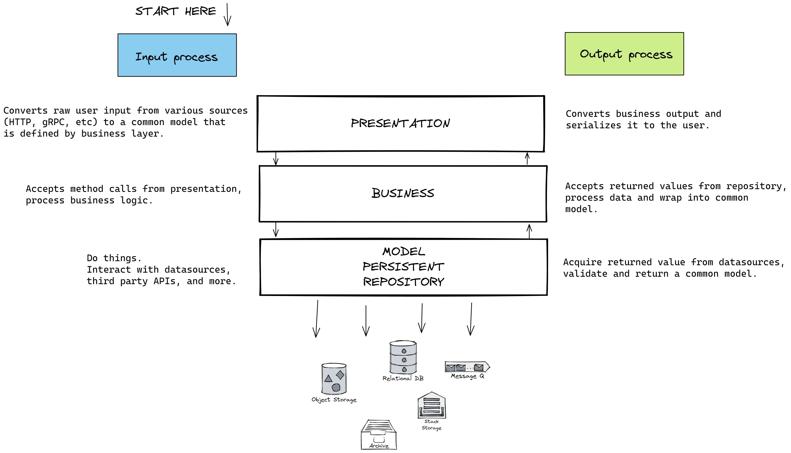

# Hotel API

This is not a finished API. This repository is meant for YOU to learn to code backend properly.
That is by constantly testing the code using proper testing suite, not constantly opening up Postman
and hit the URL over and over again just to have the happy flow working. Please read this README file completely.

It is encouraged not to run the application during the time you are developing it. Trust me, it won't run
as you expect it to be. Rather, do software testing.

To learn what software testing is, watch [Fireship's video on Software Testing](https://www.youtube.com/watch?v=u6QfIXgjwGQ).
If you don't like watching video, you can read [this article from IBM](https://www.ibm.com/topics/software-testing).

As I said it before, the application is not finished yet. You can go ahead and fork or clone this repository, and
open your favorite code editor or IDE for Node.js development, and search the whole repository for `TODO` and `todo`.
There are a lot of things that you can work on, from the application side and the testing side.
If there are no `TODO` on the file, it means (probably) the file is completed and should (again, probably) not be
touched.

## Directory Structure

If you open the `src` directory, you will be most likely to confused on what's the architecture pattern that
we are using. You can call it whatever you want. Modified version of Model-View-Controller, or trimmed-down version
of [Onion Architecture](https://marcoatschaefer.medium.com/onion-architecture-explained-building-maintainable-software-54996ff8e464).

| Directory              | Description                                                                                                                                                                                                                                                                                                                                                               |
|------------------------|---------------------------------------------------------------------------------------------------------------------------------------------------------------------------------------------------------------------------------------------------------------------------------------------------------------------------------------------------------------------------|
| Primitive              | Domain models that can be shared across layers. You can import this into business, presentation, or even repository.                                                                                                                                                                                                                                                      |
| PresentationInterfaces | Interface for defining `Presentation` layer                                                                                                                                                                                                                                                                                                                               |
| Presentation           | Presentation layer that implements interface defined from `PresentationInterfaces`. This layer only accept user input from the outside world, convert into a common model that is accepted by the `Business` layer, calls the `Business` method/function, convert the returned value from the `Business` layer into a model that is accepted by the user as the response. |
| BusinessInterfaces     | Interface for defining `Business` layer                                                                                                                                                                                                                                                                                                                                   |
| Business               | Business layer. It does not care about the `Presentation` layer. It only knows the interface of `Repository` layer. It calls required methods from the `Repository` layers as a part of the business process, and convert them into a common model.                                                                                                                       |
| RepositoryInterfaces   | Interface for defining the `Repository` layer.                                                                                                                                                                                                                                                                                                                            |
| Repository             | Repository layer. Handle data sources, third party APIs, object storage, message queue, and more. It should provide basic functionalities to do things that are related to data.                                                                                                                                                                                          |

If you would like a visual explanation for this (click the image to see it larger):



## Development Guide

Install [Node.js](https://nodejs.org/en/) version v18 or higher.

Install [Docker Desktop](https://www.docker.com/products/docker-desktop/). Later on, you will need this to run
your local instance of PostgreSQL database.

Install Editorconfig plugin for your code editor (or IDE). This is meant for replacing Prettier for more a 
more convenient way, without the hassle of executing Prettier or fighting consistently with Prettier's formatting.
* JetBrains (https://plugins.jetbrains.com/plugin/7294-editorconfig/)
* Visual Studio Code (https://marketplace.visualstudio.com/items?itemName=EditorConfig.EditorConfig)
* Vim (https://github.com/editorconfig/editorconfig-vim)
* Sublime (https://github.com/sindresorhus/editorconfig-sublime)

Install Node Modules dependencies:

```shell
npm install
```

Generate Prisma client:

```shell
npm run prisma:generate
```

Start your local PostgreSQL instance with Docker:
```shell
docker compose up -d
```

Migrate Prisma tables:
```shell
npm run prisma:migrate
```

Now you can code in peace. A few other available commands are:

Run unit and integration tests:
```shell
npm run test
# OR
npm run coverage
```

Run ESLint to fix your code style:
```shell
npm run lint
```

Compile the application to JavaScript:
```shell
npm run build
```

Start your application (you must compile it first):
```shell
node -r dotenv/config dist/index.js
```

## Further question and discussion

Feel free to use the [repository issue](https://github.com/aldy505/hotel-api/issues) or contact me through email
(see my Github profile page) or [Telegram](https://t.me/aldy505).

## License

```
   Copyright 2022 Reinaldy Rafli <aldy505@proton.me>

   Licensed under the Apache License, Version 2.0 (the "License");
   you may not use this file except in compliance with the License.
   You may obtain a copy of the License at

       http://www.apache.org/licenses/LICENSE-2.0

   Unless required by applicable law or agreed to in writing, software
   distributed under the License is distributed on an "AS IS" BASIS,
   WITHOUT WARRANTIES OR CONDITIONS OF ANY KIND, either express or implied.
   See the License for the specific language governing permissions and
   limitations under the License.
```

See [LICENSE](./LICENSE)